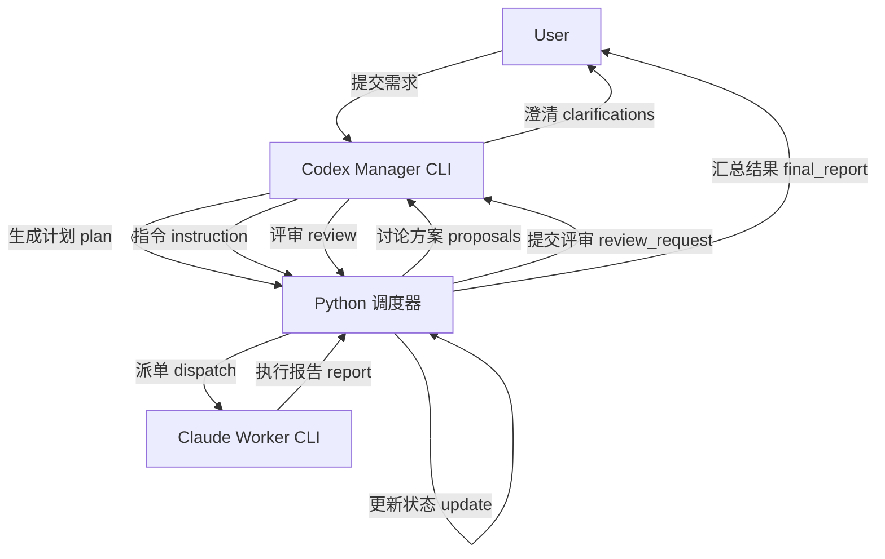
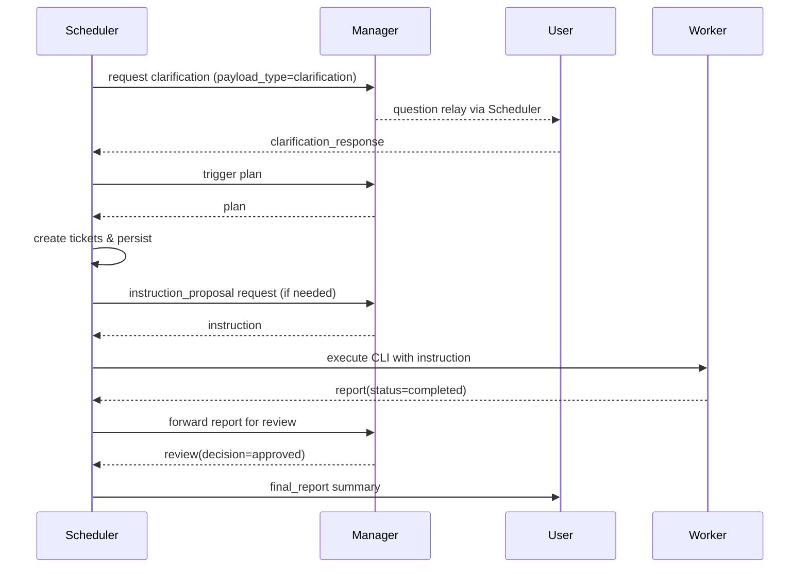
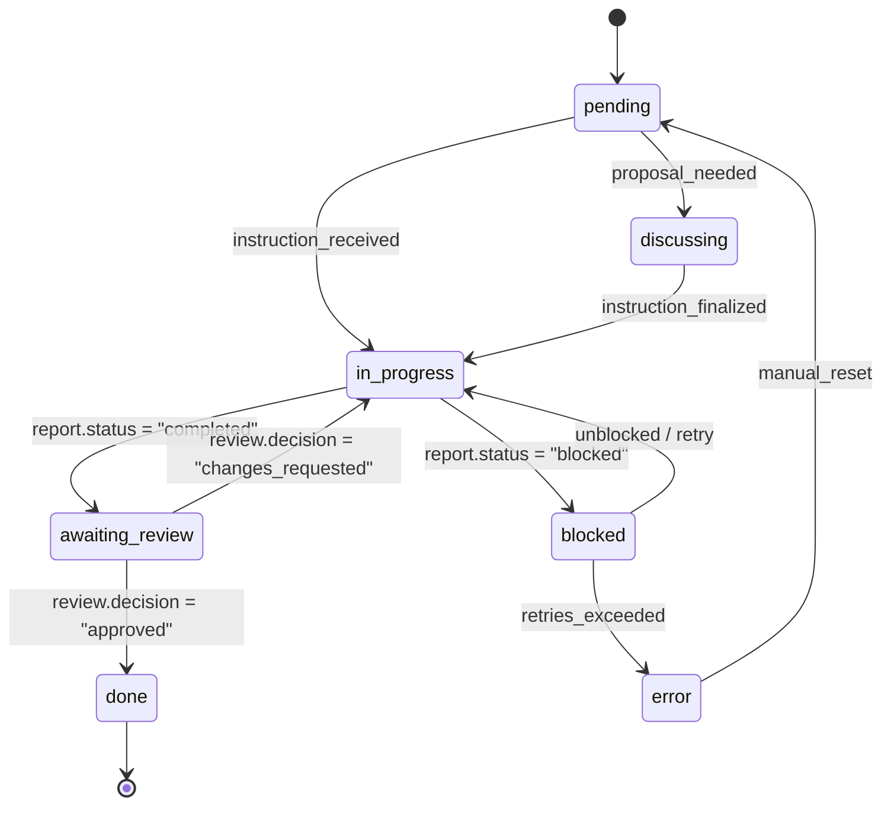

# Multi-Agent Collaboration Platform Design

## 1. Context & Goals
- 面向 Codex Manager CLI 与 Claude Worker CLI 的多智能体协作，Python 调度器负责全局控制。
- 通过统一 JSON 协议和结构化日志保证透明、可追踪的工单生命周期。
- 平台需支持角色扩展、能力拓展及后端持久化替换，而无需大规模重构。

## 2. System Overview


## 3. Roles & Responsibilities
- **User**：提出需求、回答澄清问题、确认最终结果。
- **Codex Manager CLI**：负责需求澄清、任务拆分、指令制定、报告评审，不直接执行工单。
- **Claude Worker CLI**：根据指令执行调研、编码、抓取等任务，遇阻时返回 `blocked` 并说明所需信息。
- **Python Scheduler**：统一控制中心，驱动 CLI 交互、创建与维护工单、轮询进度、持久化状态。
- **State Store**：记录 session、tickets、日志、产出路径，默认实现可为 JSON/SQLite。

## 4. Role Registry JSON
```json
{
  "roles": [
    {
      "role_id": "manager_codex",
      "display_name": "Codex Manager CLI",
      "type": "manager",
      "cli_command": ["codex", "cli"],
      "capabilities": ["clarification", "planning", "review"],
      "supports_multiple_instances": false
    },
    {
      "role_id": "worker_claude",
      "display_name": "Claude Worker CLI",
      "type": "worker",
      "cli_command": ["claude", "code", "cli"],
      "capabilities": ["research", "coding", "scraping"],
      "supports_multiple_instances": true,
      "metadata": {
        "network": "isolated",
        "auth_profile": "default_worker"
      }
    }
  ]
}
```
- Scheduler 在加载 plan 时根据 `assigned_to.role_id` 查找角色，支持通过更新配置添加新 Worker。

## 5. Unified Session Envelope
```json
{
  "session_id": "string",
  "timestamp": "string (ISO8601)",
  "source": "string",
  "target": "string",
  "payload_type": "enum",
  "version": "string",
  "payload": {}
}
```
- 调度器在读写前后执行 JSON Schema 校验，所有消息写入 `logs/<session_id>/<sequence>-<payload_type>.json`。

### 5.1 Payload Catalog
| payload_type | Produced by | Fields (payload) | Purpose |
| --- | --- | --- | --- |
| `clarification` | Manager | `questions[]`, `status`, `intent_summary` | 请求用户补充信息 |
| `clarification_response` | User/Scheduler | `answers[]`, `status` | 回答问题或标记澄清完成 |
| `plan` | Manager | `tasks[]` with `task_id`, `description`, `dependencies[]`, `expected_outputs`, `assigned_to`, `status` | 任务拆分 |
| `ticket` | Scheduler | `ticket_id`, `task_id`, `owner`, `status`, `history[]` | 调度器内部工单镜像 |
| `instruction_proposal` | Manager | `summary`, `open_questions`, `risks`, `draft_steps[]` | Manager 与 Worker 方案讨论 |
| `instruction` | Manager | `summary`, `steps[]`, `resources`, `acceptance_criteria` | Worker 执行指令 |
| `report` | Worker | `status`, `outputs`, `evidence`, `issues`, `next_actions` | Worker 执行反馈 |
| `review` | Manager | `decision`, `notes`, `requested_changes` | 评审结果 |
| `artifact_ref` | 任一方 | `label`, `uri`, `digest`, `content_type`, `size_bytes`, `description` | 引用或登记产出物的元数据 |
| `error` | 任一方 | `code`, `message`, `resolution_hint` | 捕获异常或协议违例 |

## 6. Ticket Lifecycle
1. **创建**：Scheduler 解析 `plan.tasks[]`，生成 `ticket`，初始 `status="pending"`。
2. **准备**：若 `task.risks` 或 `expected_outputs` 表示高风险，Scheduler 触发方案讨论；`instruction_proposal` 与 `report(status="proposal")` 记录在 `ticket.history[]`。
3. **下发**：正式 `instruction` 到达时，ticket 变为 `in_progress`，Scheduler 调用对应 CLI。
4. **执行**：Worker 返回 `report`；`completed` 更新 ticket->`awaiting_review`，`blocked` 或 `error` 时记录并重试或回退。
5. **评审**：Scheduler 转发至 Manager，等待 `review`。`changes_requested` 进入修订回合，`approved` 则 `status="done"`。
6. **归档**：全部 tickets `done` 后，Scheduler 汇总 `final_report.json` 并通知 User。

## 7. Scheduler Architecture
### 7.1 Modules
- `protocol.py`：定义数据模型与 JSON Schema，提供 `validate_envelope(envelope)`。
- `state_store.py`：读写接口 `get_session(session_id)`, `upsert_ticket(ticket)`, `append_history(ticket_id, event)`，默认 JSON/SQLite 实现，允许注入自定义后端。
- `cli_adapter.py`：封装 CLI 调用，支持超时、重试、stderr 捕获，向 Scheduler 返回解析后的 Envelope。
- `scheduler.py`：核心事件循环，基于依赖解析派单，处理状态机转换。
- `renderer.py`：格式化终端输出，保持用户可见性与结构化日志的一致性。

### 7.2 Event Loop


### 7.3 State Machine


## 8. Persistence & Logging
- 日志目录：`logs/<session_id>/`
  - `<sequence>-<payload_type>.json`：所有 Envelope 原文。
  - `events.log`：结构化行级日志 `[timestamp][ticket_id][event] message`。
- State Store 同步维护：
  - `sessions`：基础元数据、当前状态、角色绑定。
  - `tickets`：工单详情、依赖、当前状态、历史列表。
  - `artifacts`：最终输出的文件路径与摘要。
- 默认实现：`sqlite_state_store.py` 使用 SQLite，提供事务化更新；可通过注册其他实现（如 Postgres、S3）扩展。

### Timestamp / 时间戳规范

- 所有出现在 Envelope 和 Payload 中的时间戳，规范输出为 **UTC**，格式为 ISO 8601 且以 `Z` 结尾，例如：`2025-12-06T12:34:56Z`。
- 解析时，允许带显式时区偏移的字符串（例如 `2025-12-06T20:34:56+08:00`），但会统一转换为 UTC；缺失时区信息（naive datetime）视为错误并抛出异常。
- 生成/写出时一律输出 `Z` 结尾，避免混用偏移格式。

### Artifact Reference (`artifact_ref`)

- 字段含义：
  - `label`：人类可读名称（必填）。
  - `uri`：产出物的位置（必填）；如果是本地文件，建议使用相对路径或 `file://`。
  - `digest`：内容摘要（如 `sha256:...`），用于去重与校验。
  - `content_type`：MIME 类型，例如 `application/json`、`text/markdown`。
  - `size_bytes`：文件大小（字节，非负整数）。
  - `description`：补充说明。
- 存储位置：本地产出文件统一放在 `sessions/<session_id>/artifacts/` 下；`uri` 可引用该目录内的相对路径。

## 9. Error & Timeout Handling
- JSON 校验失败：Scheduler 回复 `error`（code: `validation_failed`），阻止状态推进并记录日志。
- CLI 调用失败：`cli_adapter` 捕获非零退出，生成 `error` Envelope；Scheduler 比较重试次数（默认 2 次），超限升级到 Manager 请求新方案。
- 依赖长时间未完成：Scheduler 在 Renderer 中播报提示，同时发送 `report(status="blocked", issues=[...])` 给 Manager。
- Worker 超时：返回 `error`(`code="timeout"`)；Scheduler 可调度其他 Worker 或请求缩小任务范围。

## 10. Extensibility
- **新增角色**：在角色配置中添加条目即可；Scheduler 依据 `type` 选择调度策略，`capabilities` 用于 Worker 选择。
- **多会话并行**：通过 session 隔离日志与状态，可运行多实例或线程，共享 State Store。
- **存储后端**：State Store 使用接口约束，易于替换为云数据库或文档存储。
- **安全策略**：可在 Envelope 引入签名、身份字段；`metadata` 支持速率限制与权限定义。
- **配置化调度**：将超时、重试、告警策略外置为 `scheduler_config.json`，便于运营调优。

## 11. User-Facing Output
- 澄清问题、工单状态变动、评审结论等关键节点通过 Renderer 实时输出。
- 收尾时生成 `final_report.json` 与人类可读总结，包含任务状态、产出路径、后续建议。
- 提供概览表或进度条，定期刷新任务进度与负责人信息，确保透明度。

## 12. Implementation Backlog
1. 定义 JSON Schema 文件并集成校验库（`jsonschema`）。
2. 完成 role registry 解析与依赖图构建。
3. 实现 CLI Adapter，支持 Streaming 读写与超时控制。
4. 搭建 SQLite State Store，包含迁移脚本与索引。
5. 实现 Scheduler 主循环、状态转换、事件处理。
6. 构建 Renderer 与日志格式，集成用户输入接口。
7. 编写端到端集成测试，验证澄清、执行、评审全流程。
